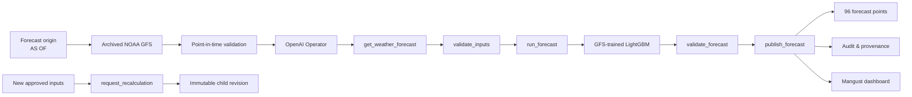

<p align="center">
  
</p>

<h1 align="center">Mangust</h1>

<p align="center">
  <strong>Agentic AI operator for 24–48 hour wind-power forecasting.</strong>
</p>

<p align="center">
  
  
  
  
  
  
</p>

## From weather forecast to an approved power forecast

Mangust is an autonomous forecasting operator for wind farms. It reconstructs the information that was actually available at a selected point in time, obtains the corresponding archived NOAA GFS weather forecast, runs the numerical forecasting engine, validates the result, and publishes a complete 24–48 hour power forecast only after the workflow passes the publication gate.

For a 48-hour run with two turbines, Mangust produces:

```text
48 forecast hours × 2 turbines = 96 turbine-hour predictions
```

Every forecast is accompanied by its weather snapshot, model version, hashes, temporal checks, agent tool trace, warnings, and immutable run history.

## How Mangust works



The OpenAI model orchestrates the workflow through strict server-owned tools. Numerical turbine power comes from the forecasting engine, while publication remains protected by deterministic validation.

## The agentic workflow

Mangust uses the OpenAI Responses API with a bounded tool loop. For each run, the operator receives an immutable context: forecast origin, horizon, registered model, and server-approved weather candidates.

The normal live sequence is:

```text
1. get_weather_forecast
2. validate_inputs
3. run_forecast
4. validate_forecast
5. publish_forecast
```

A sixth tool, `request_recalculation`, creates a linked immutable revision when newer approved inputs become available.

The agent cannot change `as_of`, replace the registered model, invent weather sources, or bypass validation. The final publish gate rechecks the forecast context, model fingerprint, weather snapshot, coverage, and point count independently of the LLM.

A live configured-key smoke run completed all five OpenAI tool calls and published a full **96-point GFS forecast**.

## Forecast Replay — a time machine for energy forecasting

The core of Mangust is point-in-time replay.

Choose a historical origin such as:

```text
2026-02-06 06:00 UTC
```

and Mangust rebuilds the forecast exactly from the information allowed at that moment.

It does not simply check the GFS initialization timestamp. The weather layer verifies availability of the archived GRIB data and index objects before the simulated forecast origin, then records their provenance and hashes.

This lets the system answer:

- which GFS cycle was used;
- when the source became available;
- which model bundle produced the forecast;
- which training cutoff applied;
- whether the complete 24/48-hour horizon was present;
- which OpenAI tools were executed;
- which validation gate approved publication.

## Forecasting engine

Mangust includes dedicated forecast bundles trained and packaged for CPU inference.

The repository contains:

- `gfs-pooled-lgbm-mvp-20260131` — GFS-trained pooled LightGBM;
- `gfs-power-curve-mvp-20260131` — GFS power-curve benchmark;
- `brev-scada-pooled-lgbm-20260201` — SCADA-trained reference model.

The production feature contract for the GFS LightGBM is shared between training and serving, so backend inference builds the same feature schema used by the training pipeline.

Model bundles include their schema, training cutoff, metadata, checksums, and model fingerprint. The backend refuses incompatible or modified bundles instead of silently producing a forecast.

## Live OpenAI execution in the dashboard

The dashboard shows the real backend-recorded agent execution while a run is still in progress.

The operator panel displays:

```text
Weather source selected
Inputs validated
GFS LightGBM numerical forecast
Forecast validated
Publication approved
```

Each step transitions from waiting → running → completed using actual backend events. The numerical forecast stays private until publication is approved, then the two-turbine chart and audit become available together.

The UI also provides:

- 24 / 48 hour replay controls;
- two-turbine forecast chart;
- model and provenance cards;
- OpenAI tool timeline;
- audit evidence;
- warning and revision history;
- JSON / CSV export;
- English and Kazakh interface.

## Immutable forecasts and automatic revisions

Forecast history is append-only.

If a newer eligible weather snapshot appears, Mangust creates a child run with `parent_run_id` instead of modifying the previous forecast.

```text
ForecastRun A
    │
    └── new approved weather
             │
             ▼
        ForecastRun B
        parent = A
```

This makes the forecasting process traceable from the first prediction through every recalculation.

## Architecture

| Layer | What it does |
| --- | --- |
| **NOAA GFS adapter** | Finds and decodes archived operational weather forecasts |
| **Replay engine** | Enforces `as_of`, horizon, source availability and temporal boundaries |
| **OpenAI Operator** | Orchestrates the forecasting workflow with strict function tools |
| **Forecast engine** | Runs GFS-trained LightGBM / registered forecast bundles |
| **Publication gate** | Revalidates model, snapshot, coverage and immutable context |
| **FastAPI worker** | Executes forecast runs and durable background jobs |
| **SQLite** | Stores runs, points, jobs, events and revision history |
| **React dashboard** | Shows forecasts, live agent steps, provenance and audit |

## Reproducible demo

### 1. Create the environment

Python 3.11–3.13 is recommended.

```bash
git clone https://github.com/BAITC-Hacks/hack-ee5834af-jfn.git
cd hack-ee5834af-jfn

python -m venv .venv
source .venv/bin/activate
pip install -r requirements-backend.txt -r requirements-weather.txt
```

On Windows:

```powershell
.venv\Scripts\Activate.ps1
```

### 2. Register the GFS model and archived snapshot

```bash
mkdir -p data/runtime/models data/runtime/snapshots

cp -R artifacts/models/gfs-pooled-lgbm-mvp-20260131 \
  data/runtime/models/

cp data/fixtures/noaa-gfs-20260206T060000Z-h48.json \
  data/runtime/snapshots/gfs-feb6-06.json
```

### 3. Start the backend with OpenAI

```bash
export OPENAI_API_KEY="your-key"
export FORECAST_DATA_DIR="data/runtime"

uvicorn backend.api.app:app --host 127.0.0.1 --port 8011
```

### 4. Start the dashboard

```bash
VITE_MODEL_ID=gfs-pooled-lgbm-mvp-20260131 \
VITE_WEATHER_SNAPSHOT_ID=gfs-feb6-06 \
npm --prefix frontend run dev
```

Open the Vite URL and run the default 48-hour replay.

## Replay without the UI

Mangust can also reproduce archived weather inputs directly:

```bash
python replay.py \
  --as-of "2026-02-06T06:00:00Z" \
  --horizon 48 \
  --snapshot data/fixtures/noaa-gfs-20260206T060000Z-h48.json \
  --output-dir artifacts/replay-2026-02-06
```

For live archive acquisition, omit `--snapshot`; the NOAA GFS adapter downloads the admissible archived forecast and records its provenance.

## Forecast API

Create a forecast run:

```http
POST /forecast-runs
```

Inspect it through:

```text
GET /forecast-runs/{id}
GET /forecast-runs/{id}/forecast
GET /forecast-runs/{id}/audit
GET /forecast-runs/{id}/events
GET /health
```

Create a recalculation as a new immutable revision:

```text
POST /forecast-runs/{id}/recalculate
```

## Verification

The integrated GFS + OpenAI route has been exercised end-to-end with a real configured OpenAI key.

Latest integration validation includes:

```text
68 backend tests
10 frontend tests
frontend build
frontend lint
agent guard tests
live 5-tool OpenAI smoke
96 published GFS forecast points
```

Run the suites locally:

```bash
python -m unittest discover -s tests -v

npm --prefix frontend run test -- --run
npm --prefix frontend run lint
npm --prefix frontend run build
```

## Why the architecture matters

A conventional forecasting demo is often:

```text
CSV → model → graph
```

Mangust is an operational workflow:

```text
historical origin
    ↓
weather that actually existed then
    ↓
temporal validation
    ↓
OpenAI tool orchestration
    ↓
GFS-trained numerical forecast
    ↓
deterministic publication gate
    ↓
immutable forecast + audit
    ↓
automatic revision when inputs change
```

That turns the model output into a forecast that can be inspected, replayed, traced and reproduced.

## HackAlem AI criteria

| Criterion | Mangust evidence |
| --- | --- |
| **Task fit & workability · 25** | Hourly 24–48h forecasts for two turbines, archived weather replay, complete 96-point forecast runs |
| **Technical implementation · 25** | GFS-trained model serving, live OpenAI tool orchestration, deterministic publication gate, durable worker and immutable revisions |
| **README & reproducibility · 25** | Committed fixtures, model bundles, hashes, CLI replay, documented API, automated test suites |
| **Value & applicability · 15** | End-to-end wind-power forecast operations with live validation, provenance and automatic recalculation |
| **Development potential & originality · 10** | Point-in-time forecast time machine, live agent trace, model governance and auditable revision history |

## Repository map

```text
backend/
  agent/           OpenAI operator, prompts and strict tools
  api/             FastAPI endpoints
  forecasting/     model loaders and GFS feature contract
  replay/          point-in-time temporal validation
  storage/         forecast runs, points, events and jobs
  weather/         NOAA GFS archive access
  workflow/        worker and recalculation lifecycle

ml/                archived-GFS dataset and model training
artifacts/models/  packaged forecast bundles
data/fixtures/     reproducible GFS replay fixtures
frontend/          Mangust React/TypeScript dashboard
docs/              architecture, API and training documentation
tests/             backend, agent, replay and integration tests
replay.py          point-in-time replay CLI
```

## Built with

<p>
  
  
  
  
  
</p>

OpenAI Responses API · Python · FastAPI · LightGBM · NOAA GFS · ecCodes · SQLite · React · TypeScript · Vite

## Documentation

- [Architecture](docs/architecture.md)
- [Implementation plan](docs/implementation-plan.md)
- [Archived GFS training](docs/gfs-training.md)
- [Weather replay](docs/weather-replay.md)
- [Backend API](docs/backend-api.md)
- [OpenAI operator](backend/agent/README.md)

---

<p align="center">
  <strong>Mangust does not just predict power. It runs, validates and records the forecasting operation.</strong>
</p>
