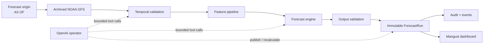

<p align="center">
  
</p>

<h1 align="center">Mangust</h1>

<p align="center">
  <strong>An auditable AI forecasting operator for wind power.</strong>
</p>

<p align="center">
  
  
  
  
  
  
</p>

## Predict the wind without seeing the future

Mangust forecasts normalized wind-turbine power for the next **24–48 hours** while reconstructing exactly what information was available at the forecast origin.

A historical replay does not use tomorrow's observed weather. It selects an archived NOAA GFS forecast that was actually available at the simulated `as_of` time, validates temporal boundaries, runs the forecast workflow, and keeps a provenance trail for every result.

That makes a run answerable, not just reproducible:

- Which weather cycle was used?
- When did it become available?
- Which model produced the forecast?
- What was the training cutoff?
- Were all 48 forecast hours present?
- Did any future information leak into the run?

## What Mangust does

- **Forecasts two wind turbines** with hourly output for 24 or 48 hours.
- **Replays historical forecasts point-in-time** instead of substituting future observations.
- **Fetches archived NOAA GFS weather** and verifies availability before the forecast origin.
- **Rejects invalid or incomplete inputs** instead of fabricating power values.
- **Stores immutable forecast runs** with forecast points, audit metadata, warnings, and lifecycle events.
- **Creates a new revision when eligible weather changes** without mutating the previous forecast.
- **Exposes the workflow through FastAPI** and a React/TypeScript operations dashboard.
- **Keeps numerical forecasting separate from the AI operator**: the agent may orchestrate tools, but it does not invent turbine power.

## How it works



The deterministic guards remain authoritative. A model or agent cannot override a failed temporal check.

## Forecast Replay

The defining feature is the **AS OF time machine**.

For a run such as:

```text
AS OF:            2026-02-06 00:00 UTC
Horizon:          48 hours
Weather cycle:    latest complete GFS cycle available before AS OF
Targets:          48 hourly intervals × 2 turbines
```

Mangust validates that every selected weather object was available no later than the forecast origin. GFS initialization time alone is not considered sufficient evidence.

A successful run produces:

```text
48 hours × 2 turbines = 96 forecast points
```

together with the weather snapshot ID, hashes, model metadata, cutoffs, warnings, and run events.

## No-future-data policy

Historical evaluation is only useful if the system cannot quietly look ahead.

Mangust enforces four boundaries:

1. **Weather availability** — archived forecast objects must be available by `as_of`.
2. **SCADA availability** — only completed and available historical intervals may be selected.
3. **Model cutoff** — training/preprocessing artifacts must respect the replay boundary.
4. **Immutable runs** — new inputs create a child revision instead of rewriting history.

> [!IMPORTANT]
> Historical observations or reanalysis are never presented as archived operational forecasts.

## Model evaluation

The project deliberately separates two different questions:

**Conditional model accuracy** asks how well turbine power can be reconstructed when observed local weather is already known.

**Operational forecasting accuracy** asks how well turbine power is predicted from weather forecasts that were available 24–48 hours earlier.

Only the second is representative of the production forecasting scenario.

The first archived-GFS experiment uses 11 historical origins and 1,056 labeled rows. On four January 2026 validation origins (384 identical rows), the GFS power-curve baseline achieved MAE **0.2044**, outperforming the GFS-trained LightGBM at **0.2472**. The baseline bundle is recommended for 06:00 UTC, 48-hour runs; the LightGBM remains experimental. This sparse retrospective result should not be confused with the earlier SCADA-weather MAE of 0.0308 or with unmeasured February accuracy.

The evaluation pipeline therefore uses chronological forecast origins, preserves the forecast horizon, and prevents future labels or weather observations from entering predictor features.

> [!NOTE]
> The supplied SCADA files end on 31 January 2026. February ground truth is not included, so Mangust does not fabricate February accuracy metrics.

## Architecture

| Layer | Responsibility |
| --- | --- |
| NOAA GFS adapter | Point-in-time archived weather acquisition and provenance |
| Replay engine | Immutable `as_of`, horizon, cutoff and no-leakage rules |
| Forecast engine | Numerical turbine power forecast |
| Validation | Input/output completeness, temporal checks and blocking conditions |
| FastAPI + worker | Durable forecast jobs, revisions, audit and events |
| SQLite | Forecast runs, points, jobs and event persistence |
| OpenAI operator | Bounded orchestration of validated forecasting tools |
| React dashboard | Replay controls, forecast chart, provenance, warnings and activity |

## Current implementation status

- ✅ Point-in-time NOAA GFS replay with availability checks
- ✅ 24/48-hour weather coverage validation
- ✅ Immutable ForecastRun API and durable worker
- ✅ Automatic child revisions for eligible updated weather
- ✅ Audit trail, hashes and lifecycle events
- ✅ React/TypeScript dashboard for two turbines
- ✅ English / Kazakh interface
- ✅ JSON / CSV forecast export
- 🚧 Native forecasting model integration and operational GFS evaluation
- 🚧 Guarded OpenAI tool orchestration

The deterministic replay/backend path is intentionally usable independently of the LLM layer.

## Quick start

### Backend

Python 3.11–3.13 is recommended.

```bash
git clone https://github.com/BAITC-Hacks/hack-ee5834af-jfn.git
cd hack-ee5834af-jfn

python -m venv .venv
source .venv/bin/activate

pip install -r requirements-backend.txt
uvicorn backend.api.app:app --host 127.0.0.1 --port 8011
```

On Windows, activate the environment with:

```powershell
.venv\Scripts\Activate.ps1
```

### Frontend

```bash
npm --prefix frontend install
npm --prefix frontend run dev
```

The Vite development server proxies `/api` to the local backend on port `8011`.

For a UI-only preview, choose **Sample data** in the dashboard. Sample values are explicitly marked and are never substituted after a real API failure.

## Reproduce a historical weather replay

A committed fixture can be validated without downloading live NOAA data:

```bash
python replay.py \
  --as-of "2026-02-06T00:00:00Z" \
  --horizon 48 \
  --snapshot data/fixtures/noaa-gfs-20260206T000000Z-h48.json \
  --output-dir artifacts/replay-2026-02-06
```

The command writes:

```text
artifacts/replay-2026-02-06/
└── weather-inputs-audit.json
```

To fetch archived GFS data directly, install the optional decoder:

```bash
pip install -r requirements-weather.txt
```

and run the replay without `--snapshot`.

## Forecast API

Create a run with registered model and weather snapshot IDs:

```http
POST /forecast-runs
```

Read the immutable result through:

```text
GET /forecast-runs/{id}
GET /forecast-runs/{id}/forecast
GET /forecast-runs/{id}/audit
GET /forecast-runs/{id}/events
GET /health
```

A recalculation creates a linked revision:

```text
POST /forecast-runs/{id}/recalculate
```

If the model, schema, cutoff, or snapshot is incompatible, the run is blocked and no synthetic power values are returned.

## Verification

Backend tests:

```bash
python -m unittest discover -s tests -v
```

Frontend:

```bash
npm --prefix frontend run test -- --run
npm --prefix frontend run lint
npm --prefix frontend run build
```

The most important integration invariant is:

```text
48 forecast hours
× 2 turbines
= 96 complete, finite turbine-hour predictions
```

## Repository map

```text
backend/
  api/             FastAPI endpoints
  forecasting/     model adapters
  replay/          point-in-time rules
  storage/         persistent runs and jobs
  weather/         NOAA GFS archive access
  workflow/        worker and recalculation logic

frontend/          Mangust operations dashboard
data/              replay fixtures and registered runtime inputs
docs/              architecture, replay and implementation notes
tests/             backend and temporal/integration tests
replay.py          reproducible AS OF replay CLI
```

## HackAlem AI criteria

| Criterion | Evidence in Mangust |
| --- | --- |
| **Task fit & workability · 25** | 24–48h two-turbine replay, real archived weather, forecast API and dashboard |
| **Technical implementation · 25** | point-in-time validation, durable worker, immutable revisions, strict model/snapshot contracts |
| **README & reproducibility · 25** | offline fixture, replay CLI, hashes, documented commands and automated tests |
| **Value & applicability · 15** | operational wind forecasting with transparent provenance instead of opaque predictions |
| **Development potential & originality · 10** | forecast time machine, auditable revisions and bounded AI orchestration |

## Design principles

**No fake success.** Missing or incompatible inputs block the run.

**No hidden future data.** Replay is based on what was actually available at the simulated origin.

**No AI-generated power values.** Numerical forecasting belongs to the forecasting engine.

**No rewritten history.** Updated inputs create a new forecast revision with a parent link.

## Built with

<p>
  
  
  
  
  
</p>

Python · FastAPI · LightGBM · NOAA GFS · ecCodes · SQLite · React · TypeScript · Vite · OpenAI

## Documentation

- [Architecture](docs/architecture.md)
- [Implementation plan](docs/implementation-plan.md)
- [Weather replay](docs/weather-replay.md)
- [Backend API](docs/backend-api.md)
- [Brev training plan](docs/brev-training.md)
- [Archived-GFS training and validation](docs/gfs-training.md)

---

<p align="center">
  <strong>Mangust turns a forecast into an auditable decision artifact.</strong>
</p>
